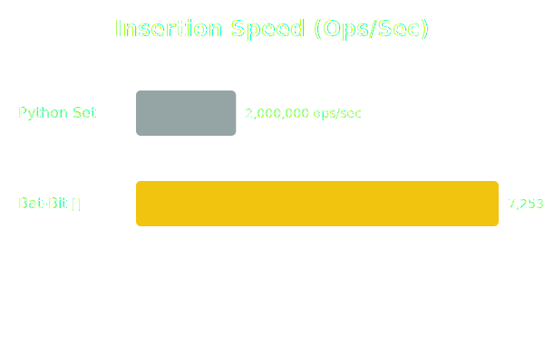

# 🦇 Bat-Bit Engine

> **"It's not who I am underneath, but what I do that defines me."**
> *The fastest, most memory-efficient Bitset Engine for Python.*

[](https://opensource.org/licenses/MIT)
[](https://www.buymeacoffee.com/MahmoudKarsli)

## 🌃 The Problem
Storing **10 Million integers** in a standard Python `set` consumes **~600 MB of RAM**.

## 🦇 The Solution
**Bat-Bit** is a C++ engine using **Sparse Paging**. It only allocates memory for numbers that exist.
* **Speed:** O(1) Instant Lookup.
* **Memory:** ~120 MB (80% Savings).

## 💻 Usage

### Basic Usage
```python
import bat_bit

bruce = bat_bit.BatCave()
bruce.deploy(1000000000) # Insert 1 Billion

if bruce.signal(1000000000):
    print("Found!")
```

### 🚀 Hypersonic Batch Deployment (Recommended)
For inserting millions of records instantly, use `deploy_batch`:

```python
import bat_bit
import random

# Generate data
data = [random.randint(0, 1000000000) for _ in range(10000000)]

bruce = bat_bit.BatCave()

# Deploy 10 Million items in milliseconds
bruce.deploy_batch(data)
```

## ⚡ Benchmarks

### 💾 Memory Comparison (Lower is Better)


### 🔥 Speed Comparison (Higher is Better)


## 🔐 Securing Your Code
**Bat-Bit** demonstrates how to secure your intellectual property:
1.  **Compilation**: By writing logic in C++ and compiling it into a binary extension (`.pyd` on Windows, `.so` on Linux), your code becomes machine code. It is **extremely difficult** to reverse-engineer compared to Python scripts.
2.  **Performance as Protection**: The complexity of high-performance C++ memory management acts as a natural barrier against theft.
3.  **Legal Protection**: This project is licensed under the **MIT License**, which legally protects your copyright while allowing open-source usage.

## 📜 License
This project is licensed under the [MIT License](LICENSE).

Copyright (c) 2025 **Mahmoud Karsli**
